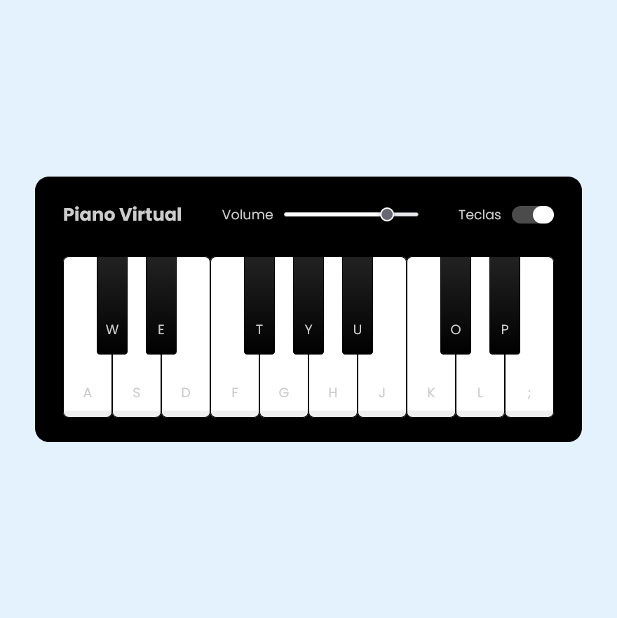

<h1 align="center">🏆 Desafio de projeto - Piano Musical</h1>

  
Este projeto não apenas oferece entretenimento, mas também demonstra várias técnicas avançadas de desenvolvimento em JavaScript.

<h2>Conheça o projeto clicando na imagem abaixo:</h2>

### Tecnologias Utilizadas

- HTML5 e CSS3 para a estrutura e aparência do piano.
- JavaScript para a lógica de programação e interatividade.

### Como experimentar

1. Clone este repositório para sua máquina local.
2. Abra o arquivo `index.html` em seu navegador web.
3. Clique nas teclas ou aperte as letras do seu teclado de acordo com o que aparece no Piano para emitir som. 

### Créditos

Este projeto foi desenvolvido como parte de um desafio educacional da Digital Innovation One.